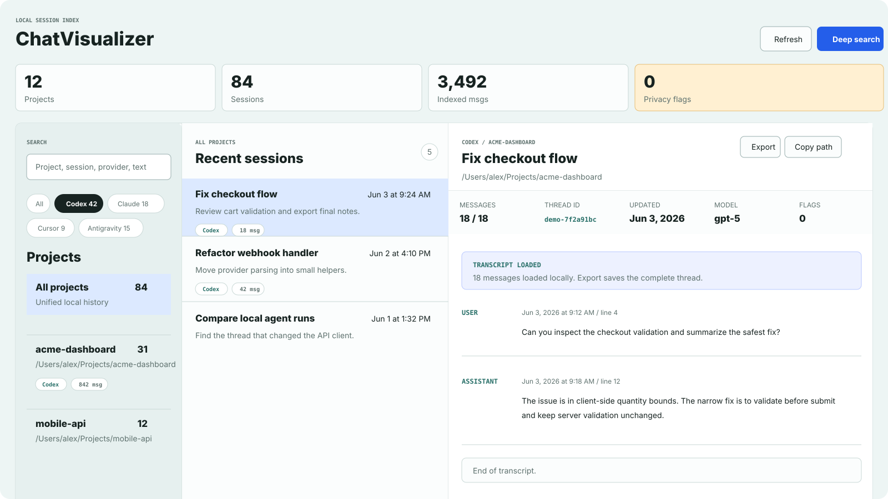

# ChatVisualizer

Local-first desktop/web app for browsing AI coding assistant history across projects.

The app runs on your computer and scans local files only. No transcript content is sent to an external service.



## Quick Start for Mac

Use this path if you do not want to use the terminal.

1. Install Node.js 20 or newer from https://nodejs.org/ if you do not already have it.
   - Choose the **LTS** version.
2. Download ChatVisualizer from GitHub.
   - Open https://github.com/dinakars777/chat-visualizer.
   - Click the green **Code** button.
   - Click **Download ZIP**.
3. Open the downloaded ZIP file.
   - macOS usually unzips it automatically.
   - If it does not, double-click the ZIP in Downloads.
4. Open the unzipped folder.
   - It is usually named `chat-visualizer-main`.
   - If you downloaded from Releases, it may be named like `chat-visualizer-0.1.0`.
5. Double-click `Start ChatVisualizer.command`.
6. Your browser should open to `http://127.0.0.1:4173`.

Leave the terminal window open while using ChatVisualizer. Close that window, or press `Control-C`, to stop the app.

If macOS blocks the launcher, Control-click `Start ChatVisualizer.command`, choose **Open**, then confirm.

If something does not open, see [Troubleshooting](docs/TROUBLESHOOTING.md).

### Getting Help From an AI Coding Assistant

You can also ask Codex, Claude Code, Antigravity, Cursor, Grok Build, or another coding assistant to help install and run ChatVisualizer from the unzipped folder.

Suggested prompt:

```text
Help me install and run this local app. Check that Node.js 20 or newer is installed, run npm install if needed, then start ChatVisualizer. Do not upload, paste, or share any transcript files.
```

## What It Detects

Detected sources:

- Codex JSONL sessions in `~/.codex/sessions` and `~/.codex/archived_sessions`
- Claude Code JSONL transcripts in `~/.claude/projects`
- Cursor composer data in `~/Library/Application Support/Cursor/User/**/state.vscdb`
- Grok Build sessions in `~/.grok/sessions/**/summary.json` and `updates.jsonl`
- Antigravity trajectory summaries in `~/Library/Application Support/Antigravity*/User/globalStorage/state.vscdb` and artifacts in `~/.gemini/antigravity/brain`

## Optional Tools

ChatVisualizer still opens without these, but some features work better with them:

- `sqlite3`: needed for Cursor and Antigravity history adapters
- `rg` / ripgrep: improves deep transcript search

## Developer Start

Use this path if you are comfortable with the terminal:

Requirements:

- Node.js 20 or newer

```sh
git clone git@github.com:dinakars777/chat-visualizer.git
cd chat-visualizer
npm install
npm start
```

Then open `http://127.0.0.1:4173`.

There is no build step. The app serves the local `public/` files from `server.js`.

## Desktop App

ChatVisualizer also includes an Electron wrapper for a Mac desktop app.

Run the desktop app from source:

```sh
npm install
npm run electron
```

Build a local Mac app bundle:

```sh
npm run package:mac
```

On Apple Silicon Macs, the packaged app is written to `dist/mac-arm64/ChatVisualizer.app`.

Build a DMG for distribution:

```sh
npm run dist:mac
```

On Apple Silicon Macs, the DMG is written to `dist/ChatVisualizer-0.1.0-arm64.dmg`.

The Electron app starts the same local server as the web version. If `http://127.0.0.1:4173` is already running, it reuses that server.

Local preview builds are ad-hoc signed. Public Mac releases should be signed and notarized before broad distribution.

## Privacy

ChatVisualizer is local-first:

- It reads supported history files from your computer.
- It does not upload transcript content.
- It does not require an account.
- It does not call an AI service.

Large transcripts are loaded in chunks. The index screen stays fast, and opening a very large session shows the first page of messages with a visible notice and a "Load next messages" action.

## License

MIT
